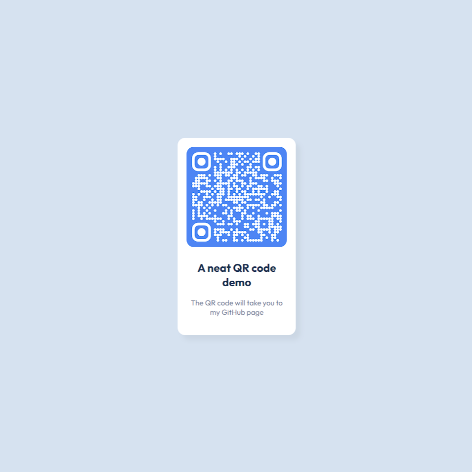

#Frontend challenge
A series of challenges to flex my frontend skills ranging from small to medium sized projects. Many of the challenges are from the wonderful Frontend Masters website.

##QR code
A simple page displaying a QR code which leads to my github page

##Results summary
A results page showing the total score as well as individual subject scores
